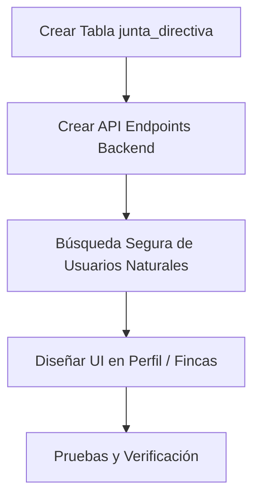

# Plan de Implementación: Junta Directiva para Personas Jurídicas

Este documento detalla el plan de diseño, base de datos, backend y frontend para la implementación de la **Junta Directiva** de empresas (Personas Jurídicas) en el sistema AgroNet, asegurando el cumplimiento de las mejores prácticas de seguridad, arquitectura y usabilidad.

---

## 🧐 Análisis del Flujo Propuesto por el Usuario

El flujo propuesto es **altamente funcional** y representa fielmente el modelo legal del sector corporativo/agropecuario. A continuación, destacamos por qué es viable y las consideraciones clave:

1. **Unificación en la Tabla `usuarios`**: Guardar tanto a las empresas (Persona Jurídica) como a los miembros de la junta (Persona Natural) en la tabla `usuarios` es correcto. Evita duplicar lógica de autenticación, dirección, teléfono, etc.
2. **Creación de Miembros Sin Capítulo Inicial**: Es una excelente práctica que el Administrador o Secretaria del capítulo puedan pre-registrar personas naturales (miembros de la junta) sin asignarles un capítulo inicial, ya que su vinculación al ecosistema se da inicialmente a través de la persona jurídica (empresa) a la que representan.
3. **Uso de `catalogo_rol`**: Reutilizar el catálogo de roles permite mantener consistencia. Sin embargo, se debe validar si los roles de la junta directiva son los mismos del sistema (ej. Tesorero, Secretario) o si se requieren roles específicos de junta corporativa.

---

## 🛠️ Propuesta de Cambios e Infraestructura

### 1. Base de Datos: Nueva Tabla `public.junta_directiva_usuario`

Para modelar la relación de la junta directiva (una empresa tiene muchos miembros, y una persona natural puede estar en la junta de varias empresas), necesitamos una tabla intermedia:

```sql
CREATE TABLE public.junta_directiva_usuario (
    id_junta_directiva_usuario BIGINT GENERATED ALWAYS AS IDENTITY PRIMARY KEY,
    id_empresa BIGINT NOT NULL,          -- FK a public.usuarios (tipo_persona = 'juridica')
    id_miembro BIGINT NOT NULL,          -- FK a public.usuarios (tipo_persona = 'natural')
    id_rol INT NOT NULL,                 -- FK a public.catalogo_rol (ej: Presidente, Secretario)
    fecha_nombramiento DATE NOT NULL DEFAULT CURRENT_DATE,
    estado VARCHAR(20) NOT NULL DEFAULT 'activo' CHECK (estado IN ('activo', 'inactivo')),
    fecha_creacion TIMESTAMP WITH TIME ZONE DEFAULT NOW(),
    creado_por BIGINT,                   -- Auditoría de quién registró la asignación

    CONSTRAINT fk_junta_empresa FOREIGN KEY (id_empresa) 
        REFERENCES public.usuarios("idUsuario") ON DELETE CASCADE,
    CONSTRAINT fk_junta_miembro FOREIGN KEY (id_miembro) 
        REFERENCES public.usuarios("idUsuario") ON DELETE RESTRICT,
    CONSTRAINT fk_junta_rol FOREIGN KEY (id_rol) 
        REFERENCES public.catalogo_rol(id) ON DELETE RESTRICT,
    CONSTRAINT fk_junta_creador FOREIGN KEY (creado_por) 
        REFERENCES public.usuarios("idUsuario") ON DELETE SET NULL,
        
    -- Evitar que la misma persona tenga el mismo rol dos veces en la misma empresa
    CONSTRAINT uq_empresa_miembro_rol UNIQUE (id_empresa, id_miembro, id_rol)
);

-- Índices para búsquedas de juntas por empresa
CREATE INDEX idx_junta_empresa ON public.junta_directiva_usuario(id_empresa);
CREATE INDEX idx_junta_miembro ON public.junta_directiva_usuario(id_miembro);
```

---

## 🛡️ Recomendaciones de Seguridad y Buenas Prácticas

### 🔒 1. Control de Ámbito (Multi-tenancy y Leak de Datos)
> [!IMPORTANT]
> Dado que los miembros de la junta se registran inicialmente **sin capítulo**, existe el riesgo de que un Administrador del Capítulo A vea o asigne usuarios creados por el Capítulo B.

* **Recomendación**: Agregar una columna `creado_por_capitulo` o buscar únicamente usuarios creados por administradores del mismo capítulo, o usuarios globales sin capítulo asignado.
* **Seguridad en la Búsqueda**: El endpoint de autocompletado/búsqueda de usuarios para la junta debe estar estrictamente protegido:
  - Solo debe retornar usuarios con `tipo_persona = 'natural'`.
  - Debe filtrar para que un Administrador de Capítulo solo busque personas naturales dentro de su jurisdicción o que estén marcadas como "huérfanas" (sin capítulo).

### 👥 2. Privilegios de Acceso Heredados
* **¿Qué puede hacer un miembro de la junta?**: Si un usuario es miembro de la junta directiva de una empresa, ¿debe tener permisos para ver o editar las fincas de esa empresa?
* **Recomendación**: Implementar una función en la base de datos o backend que al validar permisos de edición de finca (`puedeEditarSeleccionada`), no solo verifique si es el dueño directo (`id_propietario`), sino también si pertenece a la junta directiva activa de la empresa propietaria con un rol autorizado (ej: Presidente o Representante Legal).

### ✉️ 3. Flujo de Invitación y Activación Diferida (Cuentas "Solo Registro")
* **Estado Inicial ("Solo Registro")**: Cuando un usuario es creado para la junta directiva, se creará sin contraseña activa (`password = null` o un hash temporal inútil) y con `activo = false`. Esto evita intentos de inicio de sesión no autorizados.
* **Invitación Futura**: Si el administrador decide que el miembro de la junta debe interactuar con el sistema:
  1. Se habilitará una opción de "Enviar Invitación de Acceso".
  2. Al enviarla, se asocia al usuario a un capítulo específico en la tabla `usuario_rol`.
  3. El sistema genera un token de invitación temporal enviado por correo.
  4. El miembro de la junta accede al enlace de invitación, crea su contraseña, configura su Doble Factor (2FA) y activa su cuenta (`activo = true`).

---

## 📋 Plan de Tareas para la Implementación



### Paso 1: Base de Datos
- [ ] Ejecutar el script SQL para crear la tabla `junta_directiva` e índices.

### Paso 2: Backend (Node.js API)
- [ ] **Endpoint `GET /api/junta-directiva/:id_empresa`**: Obtiene los miembros de la junta de una empresa con sus nombres y roles.
- [ ] **Endpoint `POST /api/junta-directiva`**: Asigna un miembro a la junta directiva. Valida que:
  - La empresa sea realmente de `tipo_persona = 'juridica'`.
  - El miembro sea realmente de `tipo_persona = 'natural'`.
  - El usuario autenticado tenga permisos (Admin/Secretaria del capítulo de la empresa).
- [ ] **Endpoint `DELETE /api/junta-directiva/:id_junta_directiva`**: Remueve a un miembro de la junta.
- [ ] **Endpoint `GET /api/usuarios/buscar-naturales?q=...`**: Buscador con autocompletado para encontrar personas naturales y agregarlas a la junta.
- [ ] **Flujo de Invitación**: Endpoint `POST /api/usuarios/:id/invitar` para asociar al usuario de la junta a un capítulo, generar el token y preparar la activación.

### Paso 3: Frontend (Angular)
- [ ] **Modificar la pantalla de Perfil/Usuarios**:
  - Si el usuario seleccionado es `tipo_persona === 'juridica'`, mostrar una sección llamada **👥 Junta Directiva**.
- [ ] **Componente de Junta Directiva**:
  - Tabla que liste: Miembro, Rol en Junta, Fecha Nombramiento, y botón para Eliminar.
  - Buscador predictivo (autocompletado) que permita buscar usuarios existentes por nombre, correo o DNI.
  - Selector de Rol (obtenido de `catalogo_rol`).
  - Botón para "Agregar Miembro".
  - Opción de **"Invitar a interactuar"** en cada fila para activar la cuenta asociándola a un capítulo en caso de que aún no lo esté.

---

## 🧪 Plan de Verificación

### Pruebas Automatizadas
- Probar mediante Postman/Jest que un usuario con `tipo_persona = 'natural'` no pueda tener una junta directiva (debe retornar error `400`).
- Validar que un Administrador de un capítulo no pueda registrar miembros en la junta directiva de una empresa de otro capítulo (debe retornar `403 Forbidden`).

### Pruebas Manuales
1. Crear un usuario de tipo "Persona Jurídica" (Empresa).
2. Crear 3 usuarios de tipo "Persona Natural" sin capítulo.
3. Entrar al perfil de la empresa y agregarlos a la junta directiva asignándoles roles como Presidente, Tesorero, etc.
4. Validar que la tabla se actualice en tiempo real.
